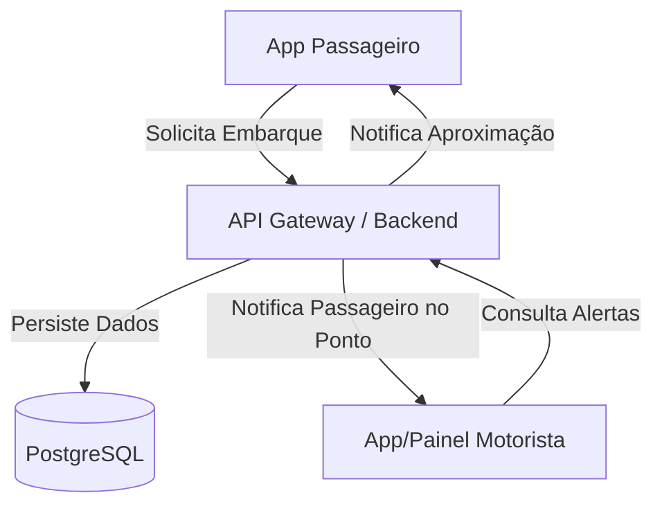

# Arquitetura do Sistema - BusAcessível

## Visão Geral
O sistema é composto por três pilares principais que garantem acessibilidade total e segurança no embarque de passageiros com deficiência visual.

## Componentes

### 1. Backend (NestJS/Fastify + TypeScript)
- **Módulo de Autenticação**: Gerencia o vínculo de dispositivos (Device Binding) e validação via SMS/WhatsApp (OTP).
- **Módulo Geográfico**: Calcula a proximidade entre o ônibus (GPS do motorista) e os pontos de ônibus com solicitações ativas.
- **Módulo de Embarque**: Gerencia o ciclo de vida de uma solicitação (Aguardando -> Notificado -> Embarcado).

### 2. Banco de Dados (PostgreSQL + Prisma)
- Armazenamento de dados geográficos e relacionais.
- Histórico de viagens para análise de demanda e segurança.

### 3. Frontend (Next.js / React Native)
- **Interface Passageiro**: Otimizada para leitores de tela (VoiceOver/TalkBack), com botões grandes e feedback háptico.
- **Interface Motorista**: Painel de baixa distração com alertas sonoros automáticos.
